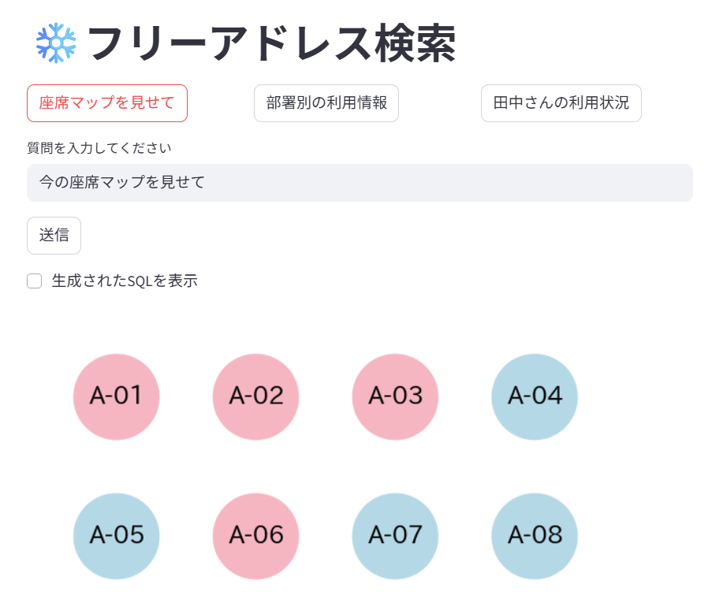
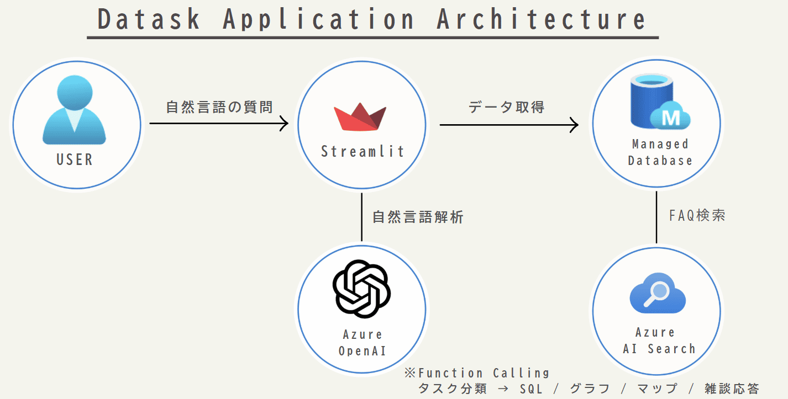

# おしゃべりデータ（Datask） 

おしゃべりデータ(Datask) は、自然言語で座席の利用状況を問い合わせできるStreamlitアプリケーションです。



[デモ動画](https://www.docswell.com/s/sakai_path/vVN3R9J-datask-hackathon2025)

> 「今の座席マップを見せて」 ── そんな会話だけで、AI が  
> ① 日本語 → ② T-SQL 変換 → ③ DB クエリ → ④ 表・グラフ表示 まで自動で行います。

# 技術スタック

| レイヤ | 採用技術 |
|-----------------|----------|
| フロント | **Streamlit** (Python) |
| 言語モデル | **Azure OpenAI** GPT-4 |
| DB | **Azure SQL** (Managed) |
| 検索補助 (RAG) | **Azure AI Search** |
| シークレット | Streamlit Cloud Secrets |

※ 本プロジェクトの設計・実装には **ChatGPT (GPT-4o)** を開発補助として活用しています。

# 構成要素



| コンポーネント | 役割 |
|---|---|
| **User** | 質問（自然言語）を入力します |
| **Streamlit** | UI描画と処理フローの制御を行うアプリ本体です。入力をAzure OpenAIやDBに橋渡しします |
| **Azure OpenAI (Function Calling)** | 自然言語の質問を以下の4分類に自動判定します<br>① SQL生成<br>② グラフ描画<br>③ 座席マップ表示<br>④ 雑談応答 |
| **Azure SQL Database** | 社員・座席・利用ログなどの構造化データを格納し、AIによって生成されたSQLで検索します |
| **Azure AI Search** | 特定キーワードに対してFAQ形式の補足検索や補助知識ベースとして動作します（※未使用でも可） |

## Function Calling による自動タスク分岐

Azure OpenAI（GPT-4）に Function Calling を組み合わせ、ユーザーの質問文を以下の4種に分類して適切な処理を行います。

* **SQL**：例「北フロアの空席を一覧で出して」 → SQL生成＋DB検索
* **グラフ**：例「田中さんの月別利用状況」 → 社員別利用ログを集計・描画
* **マップ**：例「今空いてる席は？」 → 現在の空席状況をマップ描画
* **雑談**：例「こんにちは」「このアプリでできることは？」など → チャット応答で返答


# 特長

| 機能 | 説明 |
|------|------|
| 自然言語 ➜ SQL 変換 | Azure OpenAI（GPT-4）Function Calling で SELECT 文を自動生成 |
| グラフ／表の自動切替 | 質問意図を解析し、表・棒グラフ・ヒートマップなどを自動で選択表示 |
| FAQ × AI Search | よくある質問を Azure AI Search にインデックス。類似質問には即 FAQ で回答 |
| スキーマ安全性 | INSERT/UPDATE/DELETE を禁止し、読み取り専用クエリだけ生成 |
| Streamlit UI | ワンページ＆角丸デザインでシンプル・フレンドリー |

# ディレクトリ構成

```
📁 datask-hackathon-main/
│
├── 📄 .gitignore
├── 📄 LICENSE
├── 📄 README.md
├── 📄 requirements.txt
│
├── 📁 .devcontainer/
│   └── 📄 devcontainer.json
│
├── 📁 datask_app/                  ← アプリケーション本体（Streamlit）
│   ├── 📄 app.py                   ← Streamlit UIと処理フロー
│   ├── 📄 config.py
│   │
│   ├── 📁 core/                    ← 中核機能（DB, OpenAI, 検索）
│   │   ├── 📄 ai_search.py        ← Azure AI SearchによるFAQ検索
│   │   ├── 📄 config.py           ← 設定ファイル読み込みなど
│   │   ├── 📄 db.py               ← Azure SQL接続・クエリ実行
│   │   ├── 📄 employee.py         ← 社員データ処理（名前からコード取得など）
│   │   ├── 📄 openai_sql.py       ← Function Callingでタスク判定＋SQL生成
│   │   └── 📄 schema.py           ← テーブル構造のヒント定義
│   │
│   ├── 📁 fonts/
│   │   └── 📄 ipaexg.ttf          ← グラフ用フォントファイル
│   │
│   ├── 📁 testdata/
│   │   └── 📄 seatlog_dummy.py    ← ダミーデータ登録用スクリプト
│   │
│   ├── 📁 tools/
│   │   └── 📄 upload_faq.py       ← FAQデータのインポートツール
│   │
│   └── 📁 visual/                 ← 可視化（グラフ・座席マップなど）
│       ├── 📄 charts.py          ← 利用状況グラフ描画
│       └── 📄 seatmap.py         ← 現在の座席状態の可視化
│
└── 📁 images/
    ├── 📄 map.png                 ← サンプル座席マップ画像
    └── 📄 system.png              ← システム構成図
```

# 座席管理システム テーブル定義

## 1. Seat テーブル（座席マスタ）
各座席の識別と属性情報を管理

| 列名 | 型 | 説明 |
|------|----|----|
| SeatId | INT（PK） | 座席ID（自動採番） |
| Label | NVARCHAR(20) | 表示名（例: A-1） |
| Area | NVARCHAR(20) | エリア名（例: 北フロア） |
| SeatType | NVARCHAR(20) | 種別（例: フリー/固定） |

## 2. Employee テーブル（社員マスタ）
利用者（社員）の情報を管理

| 列名 | 型 | 説明 |
|------|----|----|
| EmpCode | VARCHAR(10)（PK） | 社員コード（例: E10001） |
| Name | NVARCHAR(50) | 氏名 |
| Dept | NVARCHAR(30) | 部署 |

## 3. SeatLog テーブル（着席ログ）
誰がいつどの席を使ったかの記録

| 列名 | 型 | 説明 |
|------|----|----|
| LogId | INT（PK） | ログID（自動採番） |
| SeatId | INT（FK→Seat） | 使用された座席ID |
| EmpCode | VARCHAR(10)（FK→Employee） | 利用者の社員コード |
| CheckIn | DATETIME2 | 着席時刻 |
| CheckOut | DATETIME2（NULL可） | 離席時刻（まだ座っている場合はNULL） |

# クレジット

* Azure OpenAI Service
* Streamlit  
* Azure AI Search
* 本プロジェクトの設計・実装には、OpenAI ChatGPT（GPT-4o）を開発補助として活用しています。
  
# 補足

本アプリは 「 [Code; Without Barriers Hackathon 2025ハッカソン](https://cwbhackathon.com/) 」用に開発されたプロトタイプです。
 
